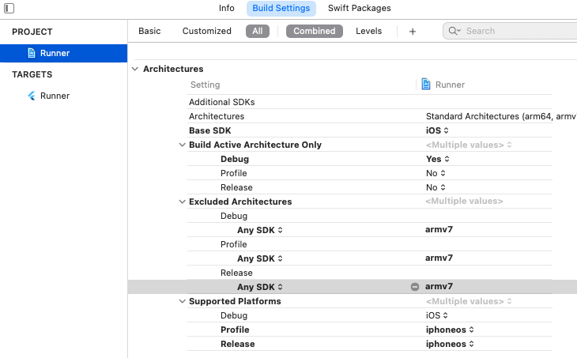

# EkycID SDK for Flutter
 

The EkycID Flutter SDK lets you build a factastic OCR and Face Recognition experienced in your Android app.

With one quick scan, your users will be able to extract information from thier identity cards, passports, driver licenses, license plate, vehicle registration, covid-19 vaccinate card, and any other document by government-issued.


EkycID is:
* Easy to integrate into existing ecosystems and solutions through the use of SDKs that supported both native and hybrid applications.
* Better for user experience being that the document detections and liveness checks are done directly offline on the device.
* Great for cutting down operations cost and increasing efficiency by decreasing reliance on human labor and time needed for manual data entry. 


EkycID can:
* Extract information from identity documents through document recognition & OCR.
* Verify whether an individual is real or fake through liveness detection, and face recognition. 
* Verify the authenticity of the identity documents by combining the power of document detection, OCR, liveness detection, and face recognition. 

This Flutter SDK is a wrapper around our Native SDK ([Android](https://github.com/EKYCSolutions/ekyc-id-android) & [iOS](https://github.com/EKYCSolutions/ekyc-id-ios)).

## 1. Requirements

### iOS
- Minimum iOS Deployment Target: 10.0
- Xcode 13 or newer
- Swift 5
- EkycID only supports 64-bit architectures (x86_64 and arm64).

### Android
- minSdkVersion: 21
- targetSdkVersion: 32
- compileSdkVersion 32

## 2. Installation

### 2.1. Flutter Setup
To use this plugin, add `ekyc_id_flutter` as a dependency in your pubspec.yaml file.
```yaml
dependencies:
  ...
  ekyc_id_flutter:
```

### 2.2 iOS Setup
**Step 1:** On iOS add the following to your Info.plist
```xml
<!-- Camera Access -->
<key>NSCameraUsageDescription</key>
<string>Camera Access for Scanning</string>

<!-- Microphone Access -->
<key>NSMicrophoneUsageDescription</key>
<string>Microphone for playing instructions audio.</string>
```

**Step 2:** Go to Project > Runner > Building Settings > Excluded Architectures > Any SDK > armv7


**Step 3:** Make adjustments to your Podfile as shown below.
```ruby
# add this line:
$iOSVersion = '10.0'

post_install do |installer|
  # add these lines:
  installer.pods_project.build_configurations.each do |config|
    config.build_settings["EXCLUDED_ARCHS[sdk=*]"] = "armv7"
    config.build_settings['IPHONEOS_DEPLOYMENT_TARGET'] = $iOSVersion
  end
  
  installer.pods_project.targets.each do |target|
    flutter_additional_ios_build_settings(target)
    
    # add these lines:
    target.build_configurations.each do |config|
      if Gem::Version.new($iOSVersion) > Gem::Version.new(config.build_settings['IPHONEOS_DEPLOYMENT_TARGET'])
        config.build_settings['IPHONEOS_DEPLOYMENT_TARGET'] = $iOSVersion
      end
    end
    
  end
end
```

### 2.3. Android Setup
No extra setup is needed.

## 3. Usage

**Step 1:** Setup URL to server.

```dart
void main() {
  WidgetsFlutterBinding.ensureInitialized();
  EkycIDServices.instance.setURL("YOUR_SERVER_URL");
  runApp(MyApp());
}
```

**Step 2:** Setup EkycIDExpress Widget

We expose an easy to use widget called `EkycIDExpress`. It handles the logic behind identity document scanning and liveness detections for you. You only expects to provide a simple callback to handle the result. Below is how you can use it.

```dart
class HomeScreen extends StatefulWidget {
  const HomeScreen({Key? key}) : super(key: key);

  @override
  State<HomeScreen> createState() => _HomeScreenState();
}

class _HomeScreenState extends State<HomeScreen> {

  Future<void> onKYCCompleted({
    required LivenessDetectionResult liveness,
    required DocumentScannerResult mainSide,
    DocumentScannerResult? secondarySide,
  }) async {
    print("== ACCESS RESULTS HERE ==");
  }

  @override
  Widget build(BuildContext context) {
    return Scaffold(
      body: Center(
        child: TextButton(
          onPressed: () async {
            await showCupertinoModalBottomSheet(
              context: context,
              builder: (BuildContext context) {
                return EkycIDExpress(
                  language: Language.KH,
                  onKYCCompleted: onKYCCompleted,
                );
              },
            );
          },
          child: Text("Start KYC"),
        ),
      ),
    );
  }
}
```

**Step 3:** Handle the results

In the `onKYCCompleted` callback, you will have access to an instance of `LivenessDetectionResult`, and two instances of `DocumentScannerResult` (One for each side of the document).

**Step 3:** Match Faces

You can perform a face compare between the face in the document and the face from liveness detection like below.

```dart

Future<void> onKYCCompleted({
  required LivenessDetectionResult liveness,
  required DocumentScannerResult mainSide,
  DocumentScannerResult? secondarySide,
}) async {
  
  ApiResult response = await EkycIDServices.instance.faceCompare(
    faceImage1: mainSide.faceImage,
    faceImage2: liveness.frontFace?.image,
  );

  print(response.data?) // match score
}

```

**Step 4:** Perform OCR

You can perform OCR on the document image like below.

```dart

Future<void> onKYCCompleted({
  required LivenessDetectionResult liveness,
  required DocumentScannerResult mainSide,
  DocumentScannerResult? secondarySide,
}) async {
  
  ApiResult response = await EkycIDServices.instance.ocr(
    image: mainSide.documentImage,
    objectType: mainSide.documentType
  );

  print(response.data?); // response object based on document type
}

```

## 4. License

© 2022 EKYC Solutions Co, Ltd. All rights reserved.
